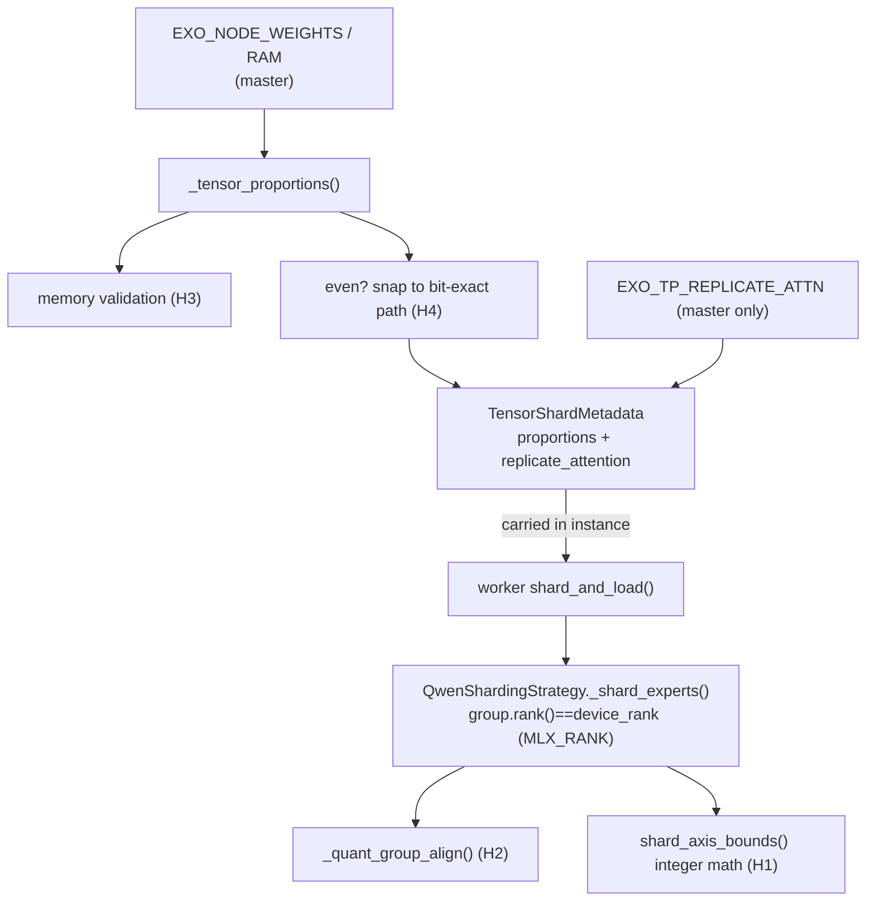

# Fork review — proportional-TP and runtime changes

Review of the fork-specific commits on top of upstream exo (`667a3bb0..HEAD`):
proportional (memory-weighted) tensor-parallel sharding, the macmon robustness
fix, opt-in KV-cache quantization / runtime defaults, and the `deploy/` tooling.
Focus, at the user's request, was the **proportion calculations**, where the two
highest-severity issues turned out to be silent-corruption modes (wrong output,
no crash) rather than crashes.

## Data flow

## Findings

| ID | Severity | Area | Issue | Status |
|----|----------|------|-------|--------|
| H1 | High | sharding | Uneven shard boundaries were re-derived per parameter array with float `round(frac*dim)`. A quantized `down_proj`'s packed weight axis (`intermediate/pack_factor`) and its scales/biases axis (`intermediate/group_size`) could round to inconsistent cut points → silently corrupted weights, no crash. | **Fixed** — extracted pure `shard_axis_bounds()` using integer math `unit*dim//total_units` with a divisibility assertion; weight/scales/biases now provably slice at the same logical point or fail loudly. |
| H2 | High | sharding | `align = int(getattr(gate_proj, "group_size", 0) or 1)` silently fell back to element alignment if a quantized module didn't expose `group_size`, mis-slicing scales. | **Fixed** — `_quant_group_align()` detects quantization (presence of `scales`) and *requires* `group_size > 1`, raising a clear error instead of degrading. |
| H3 | Medium | placement | Memory check `required = total_storage * proportion` ignored replicated attention (deploy default), KV cache, activations, overhead → placement could pass then OOM at load. | **Fixed** — footprint model `headroom * total * (replicate_fraction + (1-replicate_fraction)*proportion)`; env-tunable `EXO_TP_MEM_HEADROOM` (1.10), `EXO_TP_REPLICATE_FRACTION` (0.10 when replicating). |
| H4 | Medium | placement | Even-split detection used `abs(p-1/N) < 1e-6`; RAM jitter on homogeneous nodes is never that tight, so equal clusters needlessly took the uneven path and lost upstream's bit-exact split. | **Fixed** — tolerance widened to `EXO_TP_EVEN_TOL` (default 0.02); snaps to `proportions=None` (even) when within band. |
| H5 | Medium | placement/worker | `EXO_TP_REPLICATE_ATTN` was read independently on master (relax divisibility checks) and worker (replicate attention). Divergent env between hosts → placement accepts a config the worker crashes on. | **Fixed** — read once at placement, carried as `TensorShardMetadata.replicate_attention`; worker reads metadata, not env. |
| H6 | Low | placement | `EXO_NODE_WEIGHTS` UUID-substring matching is silent on ambiguous (>1 node) / no-match / out-of-range-rank specs. | **Fixed** — `_tensor_proportions` now warns on each and the resolved proportions are logged. |
| R1 | Medium | runtime | `KV_CACHE_BITS = int(os.environ["EXO_KV_BITS"])` ran at import with no validation; a typo crashed the runner with an opaque traceback. | **Fixed** — `_parse_kv_cache_bits()` validates against `{2,4,8}`, falls back to off (None) with a warning. |
| R2 | Low | robustness | macmon's new inner-`break` restart paths skip the psutil fallback and only sleep `macmon_interval`; a binary that crashes on launch could respawn rapidly. | **Fixed** — exponential backoff on consecutive restarts, reset once macmon delivers metrics. |
| R3 | Low | style | Function-local `import os` in `placement.py` / `shard_model`. | **Fixed** — hoisted to module top. |
| A1 | Info | API | `chat_completions.py` unconditionally sets `resolved_thinking=False; resolved_effort=None`, globally overriding client `enable_thinking`/`reasoning_effort` (double-applied with the `render_chat_template` default-off change). | **Documented** — appears to be a deliberate product choice; left as-is. Confirm intent. |
| A2 | Info | runtime | `EXO_MAX_CONCURRENT_REQUESTS` default 8→2 (`shared/constants.py`); `deploy/cluster-up.sh` overrides to 4. | **Documented** — intentional; no change. |

## Verified correct (no change)

- `MLX_RANK` is set to `device_rank` (`utils_mlx.py`), so the worker's
  `group.rank()` indexes the same `proportions` slot assigned at placement — the
  split is rank-consistent.
- `_shard_experts` handles both 3D routed `switch_mlp` and 2D `shared_expert`
  (axis derived from `ndim`); gate/up (output dim) and down (input dim) use the
  same offsets so the contraction matches and `ShardedMoE`'s `all_sum`
  reconstructs the result.
- KV-cache quantization is wired correctly — `make_kv_cache` callers pass no
  `max_kv_size`, so the new `QuantizedKVCache` branch fires when `EXO_KV_BITS`
  is set.

## Tests added

- `src/exo/worker/engines/mlx/tests/test_sharding_math.py` — pure integer math:
  segment sizing (sum, alignment, min-one, raises) and boundary mapping
  (integer/consistent across differing axis lengths, unaligned raises). Runs in
  the fast suite (no `mlx` import).
- `src/exo/master/tests/test_proportional_tp.py` — env parsing, RAM fallback,
  even-snap, uneven path, and the H3 memory-validation raises (incl. the
  replicate-fraction bias).

The MLX multi-process bit-exact harness
(`test_tp_bit_exact.py`) is `slow` + macOS/Metal-only and currently `@skip`;
exercising the uneven path end-to-end there is the natural follow-up once that
harness is re-enabled on a Mac runner.
